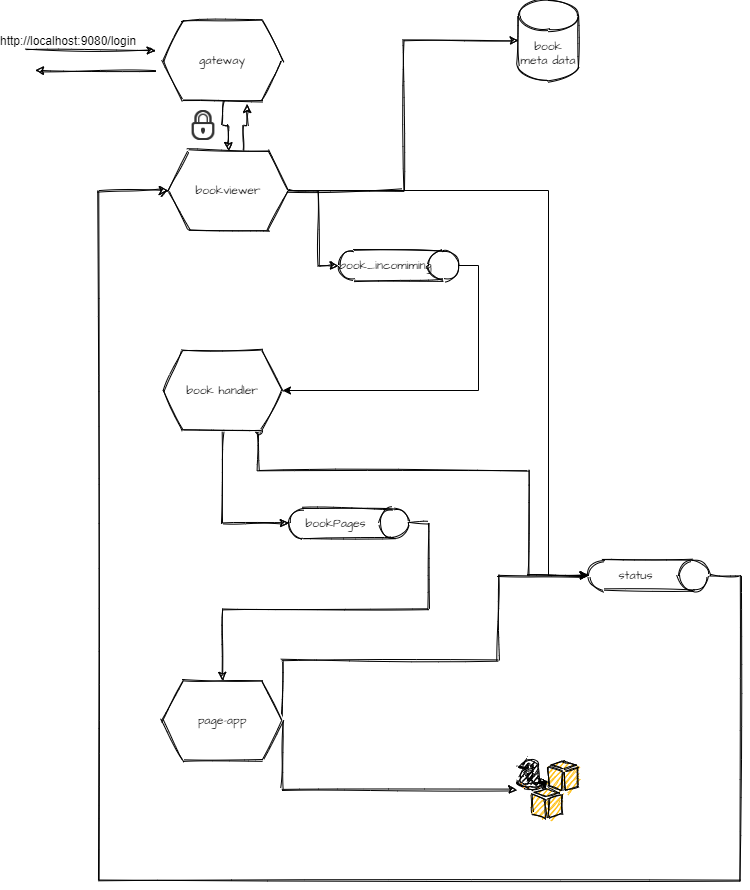

# Micronaut Book Viewer Demo

This demo consist of following micronaut microservices:
 - gateway  
 login, jwt
 - book-viewer  
    1. file upload and ISBN-13 validation (apache commons validation used - it is available in 6.0.6 Hibernate)
    2. insert book db record
    3. queue file for processing
    4. deque, listen for further processing, events and upload book info with pdf metadata and pre-signed link to page objects.
 - book-handler
   1. deque uploaded file
   2. load it as pdf, upload pdf document metadata, split it to pdf pages and 
   3. queue them for further processing 
 - page-app
    1. dequeue pages (single page pdf document)
    2. render them to picture and 
    3. save them to aws s3 as objects and
    4. render as pre-signed URL
    3. queue processing result.




## Environment


- jwt  
provide your configuration
```shell script
export JWT_GENERATOR_SIGNATURE_SECRET
```
- Run RabbitMQ locally

```shell script
docker run --rm -it -p 5672:5672 -p 15672:15672 rabbitmq:3.7.11-management
```
- Run PostgreSQL db locally
```shell script
docker run -it --rm -p 5432:5432 -e POSTGRES_USER=dbuser \
-e POSTGRES_PASSWORD=theSecretPassword \
-e POSTGRES_DB=micronaut postgres:11.5-alpine
``` 
- by default, h2 datasource is used, to use postgres datasource
export following environment variables to terminal (or put to your IDE running configuration (Intellij IDEA)) and start application or test 
```shell script
export JDBC_URL=jdbc:postgresql://localhost:5432/micronaut
export JDBC_USER=dbuser
export JDBC_PASSWORD=theSecretPassword
export JDBC_DRIVER=org.postgresql.Driver
```

- aws  
mandatory configuration as environment variable or application configuration
```shell script
export AWS_ACCESS_KEY_ID=YOUR_VALUE
export AWS_SECRET_ACCESS_KEY=YOUR_VALUE
export AWS_S3_BUCKET=YOUR_VALUE
export AWS_S3_REGION=YOUR_VALUE
```
## TBD
- [x] delete in development initially used aws acces key id and secret (...)    
- [ ] tests improvement
        - initial unit tests can not be used in with rabbitmq integrated solution 
        - the file is also queued, system change cannot be undone by db record deleting.
        - currently docker rabbitmq and postgresql image is used in development integration test, combined with rabbit mq 
        and postgresql restarting (and S3 object removing if needed (considering billing))   
- [ ] convert services in java to kotlin
- [ ] batch processing 
   - complete implementation refactoring
- [ ] rename services
    - inconsistent naming.
- [x] Use lombok?
    - No - planed migration to Kotlin and there are some Micronaut related issues [stackoverflow](https://stackoverflow.com/questions/29193806/specifying-order-of-annotation-processors)
- [ ] SPA client app

    
